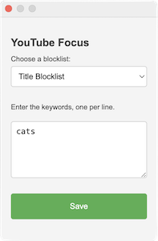

# YouTube Focus

YouTube Focus is a Chrome extension that enables users to filter out videos on the YouTube homepage based on keywords. It allows you to set up blocklists for both video titles and channel names.

## How It Works

After adding the extension to your browser, click on its icon and select either "Title Blocklist" or "Channel Blocklist" from the dropdown menu. Enter the keywords that you want to filter out, each on a new line, and then click "Save." The changes will take effect when you reload the page or scroll down to load new videos.

The blocked videos are logged in the console, allowing you to see which videos are being filtered out.

In addition to the homepage, videos are also filtered out from search results and channel pages, although in a less reliable manner.

## Installation

To install the extension, follow these steps:

1. Download or clone this repository to your machine.
2. In Google Chrome, go to "Extensions."
3. Enable the "Developer mode" toggle in the top right corner.
4. Click "Load unpacked" and select the directory where you saved the repository.

## Code Files

- `manifest.json`: This file describes the extension, its permissions, and scripts.
- `background.js`: Responsible for listening to changes in storage, particularly the blocklist of keywords.
- `content.js`: The main script injected into the YouTube site to remove videos.
- `popup.html`: The HTML for the popup that appears when you click the extension icon.
- `popup.js`: The script for saving and loading the blocklist.
- `icon.png`: The icon image file for the extension.

## Contribute

Please feel free to open an issue or submit a pull request to suggest improvements or additions.
